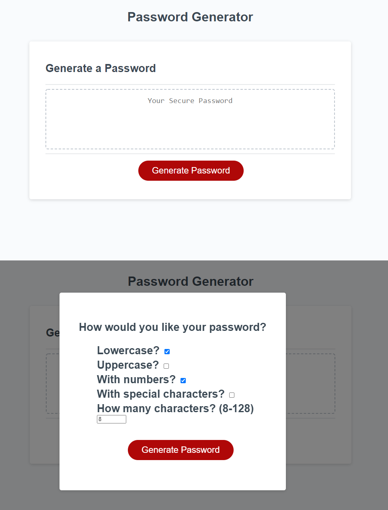

# Password-Generator

The task was to fix the code in order to make a working password generator. The password generator would ask for the specifications to create the password through a series of prompts. At first, it was built using prompts, but I found it to be slower and less user-friendly so I decided to make a div element that is shown on click where you can choose all at once how to create the password. I included a "confirm" to avoid the user to start all over again if a mistake were made.

 [Final Product:Github repository](https://csancheze.github.io/Password-Generator/)

 [Final Product:Password Generator](https://github.com/csancheze/Password-Generator/)
